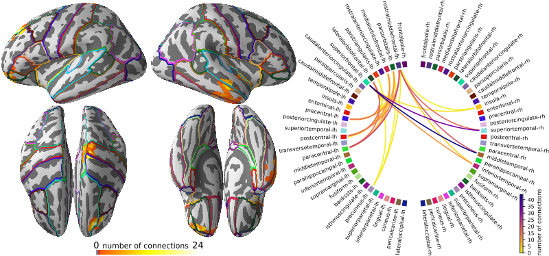

Conpy
-----
A Python library implementing the DICS beamformer for connectivity analysis and power mapping on the cortex. This is a Python reimplementation of the MATLAB code originally developed for [1]. This repository also holds the code complementing our submission to the Frontiers Research Topic: [From raw MEG/EEG to publication: how to perform MEG/EEG group analysis with free academic software](https://www.frontiersin.org/research-topics/5158)

[Marijn van Vliet, Mia Liljeström, Susanna Aro, Riitta Salmelin and Jan Kujala (2018). Analysis of functional connectivity and oscillatory power using DICS: from raw MEG data to group-level statistics in Python](https://doi.org/10.3389/fnins.2018.00586)

Installation instructions
-------------------------
Conpy requires a Python (either 2.7 or 3.5+) installation with the following packages: numpy, scipy, mayavi, mne, doit, tqdm. 
Numba is an optional dependency that, when installed, will speed up the connectivity estimation by about 100%.

To install the conpy module, run:

    pip install https://github.com/AaltoImagingLanguage/conpy/zipball/master

Documentation
-------------
A good place to get started with conpy is to read through the [simulation example](https://users.aalto.fi/~vanvlm1/conpy/auto_examples/plot_simulation.html). This creates an ideal situation of two coherent sources and applies the basic steps to analyze it.

The main documentation for the pipeline is the Frontiers publication [2], which will guide you through a complete analysis of a 20 subject MEG dataset.

Finally, there is the [API reference](https://users.aalto.fi/~vanvlm1/conpy/api.html) documentation.

### Reproducing the analysis of the publication

The `conpy/scripts/` folder contains the complete analysis pipeline as presented in the publication.
It is meant as an elaborate example that use can use as a basis for your own analysis pipeline.

To get started, first take a look at `scripts/config.py` in this repository.
There are some configuration variables there, of which the most important one is `study_path`, which controls the folder to which the data will be downloaded.
The contents of the `study_path` folder will grow to about 600GB.

Next, run `python check_system.py` to perform a series of checks to see if the data can be found and the required Python packages are properly installed. 
If everything is well, you can run the conpy pipeline in its entirety by using the [doit tool](http://pydoit.org/): `python -m doit`. This will download the data and run every step of the pipeline on all subjects and produce the figures that were presented in the publication. Use `python -m doit list` to see a list of the steps and use `python -m doit <step>` to run a single step.
The last steps of the pipeline produce the figures, which are saved in `paper/figures`.

The main advantage of using an [automated build system](https://en.wikipedia.org/wiki/Build_automation) like `doit` is that the system keeps track of each step that has successfully completed.
Should something go wrong or crash, `doit` can pick up the analysis again where it left off and avoids re-doing a step that was already completed.

#### Time and system requirements
Reproducing the entire analysis first entails running [FreeSurfer](https://surfer.nmr.mgh.harvard.edu/)'s `recon_all` script to segment the MRI data. This will take about a day per subject.
After the segmentation, running the analysis pipeline takes about 8 hours on a reasonably modern machine with at least 16GB of memory.

#### Running on a cluster
If you have access to a computational cluster that uses [SLURM](https://www.schedmd.com/) as a schedular (for example, at Aalto University, we have the [Triton cluster](http://scicomp.aalto.fi/triton/)), you can use the scripts in `conpy/scripts/sbatch` to run parts of the analysis on all subjects simultaneously. Especially for the FreeSurfer segmentation, this can drastically reduce the time needed to complete the entire analysis.

### Reproducing the manuscript
If you have LaTeX installed, you can re-build the final PDF of the manuscript (`paper/conpy.pdf`) using the figures produced by the pipeline by running `latexmk` in the `paper/` directory. There is some manual work involved: figures 3 and 4 of the manuscript are compositions made with [Inkscape](https://inkscape.org) (see `paper/figures/power.svg` and `paper/figures/connectivity.svg`).

Authors of the code
-------------------
Marijn van Vliet <marijn.vanvliet@aalto.fi>  
Susanna Aro <susanna.aro@aalto.fi>

References
----------
[1] Gross, J., Kujala, J., Hämäläinen, M., Timmermann, L., Schnitzler, A., & Salmelin, R. (2001). Dynamic imaging of coherent sources: Studying neural interactions in the human brain. Proceedings of the National Academy of Sciences, 98(2), 694–699. https://doi.org/10.1073/pnas.98.2.694

[2] van Vliet, M., Liljeström, M., Aro, S., Salmelin, R. & Kujala, J. (2018). Analysis of functional connectivity and oscillatory power using DICS: from raw MEG data to group-level statistics in Python. Frontiers in Neuroscience. https://doi.org/10.3389/fnins.2018.00586

[3] Jas, M., Larson, E., Engemann, D.-A. A., Leppäkangas, J., Taulu, S., Hämäläinen, M., … Gramfort, A. (2017). MEG/EEG group study with MNE: recommendations, quality assessments and best practices. bioRxiv. https://doi.org/10.1101/240044
